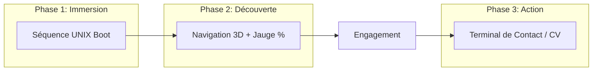

# 🌌 Portfolio Interactif: Graphe de Connexions
> **Product Requirements Document (PRD)**

**Auteur :** Jean-Gabriel Goudiaby  
**Dernière mise à jour :** 8 Avril 2026  
**Stack :** Antigravity, WebGL/Three.js, API REST/GraphQL

---

## 📋 Table des Matières
1. [Vision et Objectifs](#1-vision-et-objectifs)
2. [Cibles Utilisateurs](#2-cibles-utilisateurs)
3. [Design System & Branding](#3-design-system--branding)
4. [Fonctionnalités Principales](#4-fonctionnalités-principales)
5. [User Journey](#5-user-journey)
6. [Spécifications Techniques](#6-spécifications-techniques)
7. [Évolutivité](#7-évolutivité)

---

## 1. Vision et Objectifs
> [!NOTE]
> Créer un portfolio expérientiel en 3D qui transcende le format web classique.

Le produit doit prouver instantanément l'expertise technique de l'auteur (**Full-Stack, UI/UX, Cyber**), tout en illustrant son ADN (**Lianet, Scoutisme, Zone01**).

*   **Gamification** : L'expérience utilisateur doit encourager l'exploration active.
*   **Automatisation** : L'architecture doit être entièrement pilotée par la donnée pour minimiser la maintenance.

---

## 2. Cibles Utilisateurs

| Profil | Ce qu'ils recherchent |
| :--- | :--- |
| **CTO / Lead Devs** | Code propre, architecture robuste (Rust, Go), logique métier. |
| **Recruteurs / RH** | Compétences rapides, adaptabilité (*Learning to learn*), contact/CV. |
| **Clients / Freelance** | Professionnalisme, sécurité (DevSecOps), confiance. |

---

## 3. Design System & Branding
### 🎨 Identité Visuelle
*   **Vibe** : Mix entre un terminal réseau ultra-moderne, un arbre de compétences (Skill Tree), et une carte spatiale minimaliste.
*   **Typographie** : 
    *   `Nunito` : Titres & HUD (Head-Up Display).
    *   `Lato` : Corps de texte, descriptions, extraits de code.

### 🍱 Palette de Couleurs
*   🌑 **Dark Cyber** : Fond bleu nuit profond / Obsidian.
*   ⚡ **Bleu Électrique** : Nœuds principaux et connexions actives.
*   🔥 **Orange Soft** : Accents (Rappel du feu de camp / Scoutisme / Lianet).

---

## 4. Fonctionnalités Principales (Core Features)

### A. Moteur 3D & Navigation
*   **Canevas Infini** : Manipulation par Pan (glisser) et Zoom (molette/pincer).
*   **Exploration Dynamique** : Création interactive des nœuds (*Nodes*) et liaisons (*Edges*).
*   **Cinématiques** : Animations de caméra (*Fly-to*) lors de la sélection.

### B. Interface HUD (Head-Up Display)
*   📟 **Terminal de Commande** : Barre de recherche dynamique (ex: tapez "Rust" ➔ Vol vers le nœud).
*   📊 **Jauge d'Exploration** : Progression visuelle basée sur les nœuds visités.
*   ⚡ **Actions Rapides** : Accès direct au CV, Contact, et Switch de thème.

### C. Intégrations Automatisées (Data-Driven)
*   **API GitHub** : Fetch via GraphQL (Pinned repos, langages, commits).
*   **Flux Blog** : Intégration via flux RSS/API (Hashnode/Dev.to).
*   **CMS Headless** : Gestion des textes (Projets, Expériences) via Markdown ou CMS léger.
*   **Génération Procédurale** : Le graphe se dessine automatiquement selon le JSON d'entrée.

---

## 5. User Journey (Parcours Utilisateur)

---

## 6. Spécifications Techniques

| Component | Technology | Rôle |
| :--- | :--- | :--- |
| **Core Engine** | **Antigravity** | Routing, SSR/SSG, SEO, Orchestration. |
| **3D Rendering** | **Three.js** | Moteur graphique WebGL. |
| **Animations** | **GSAP / Framer Motion** | Transitions fluides et précises. |
| **Data Layer** | **REST / GraphQL** | Abstraction des APIs externes (GitHub, CMS). |
| **Infra** | **CI/CD Pipeline** | Re-génération quotidienne pour data fraîche. |

---

## 7. Évolutivité (Scalability)
> [!IMPORTANT]
> Le système doit être agnostique à la donnée.

L'ajout d'une nouvelle compétence ou catégorie (ex: "Machine Learning") se fait via une simple entrée JSON. Le moteur 3D calcule automatiquement :
1.  La création du nouveau nœud.
2.  La position spatiale optimale via un algorithme **Force-Directed Graph**.
3.  La liaison logique avec le nœud central ou parent.